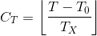
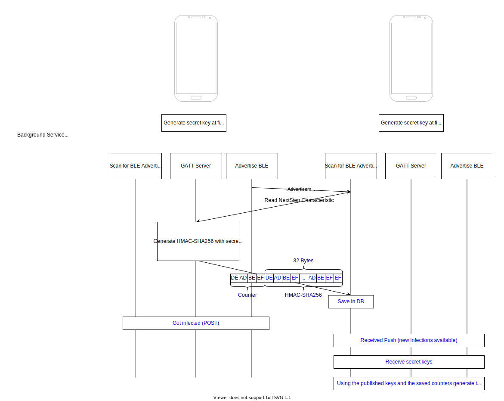

# STAR SDK Documentation

## Introduction

Here we try to provide a  complete overview and give some more technical details in the mechanisms used.

## Backend
The backend consists of two parts. The first part is a global server (for now hosted on github), which provides all the known app registrations. The API Documentation can be found [here (HTML)](backend-swagger/discovery.html) or [here (Swagger)](backend-swagger/discovery.yaml).

The SDK specific backend, which is also hosted by the app provider has its definition [here (HTML)](backend-swagger/sdk.html) or [here (Swagger)](backend-swagger/sdk.yaml).

## Architecture

The following picture shows the complete architecture. It tries to showcase how the SDK is integrated into a example App and how the servers should communicate

## TOTP Mechanism and Data Privacy

In order to ensure anonymity of clients we use so called time based one time passwords (TOTP). To generate such a TOTP we need a secret S and a counter C. 

The counter is calculated as following:

As a default value for the counter interval `1 minute` is used.

The secret itself is generated using a cryptographically secure random number generator. Since the block size of the HMAC-SHA256 algorithm is 256 bit (32 byte), our secret key has the same size. 

To generate such a TOTP we use the HMAC-SHA256 algorithm. The key is together with the counter (message) hashed. As mentioned before there exist implementation on the Android and the iOS platform.

If a person gets infected, she posts her secret key (and generates a new one for herself). Now using this secret key and the timestamp respectively the counter any other person who receives the secret key (since it is published on the infected list) can now validate all received tokens.

Since time synchronization could be a problem, we prepend the counter to the respective HMAC-SHA256 tokens. 

The following picture shows a time sequence:

## References
- [HMAC](https://en.wikipedia.org/wiki/HMAC)

- [HMAC based OTP](https://en.wikipedia.org/wiki/HMAC-based_One-time_Password_algorithm)
- [CommonCrypto](https://www.agnosticdev.com/content/how-use-commoncrypto-apis-swift-5)
- [Android HMAC](https://developer.android.com/reference/javax/crypto/Mac)
